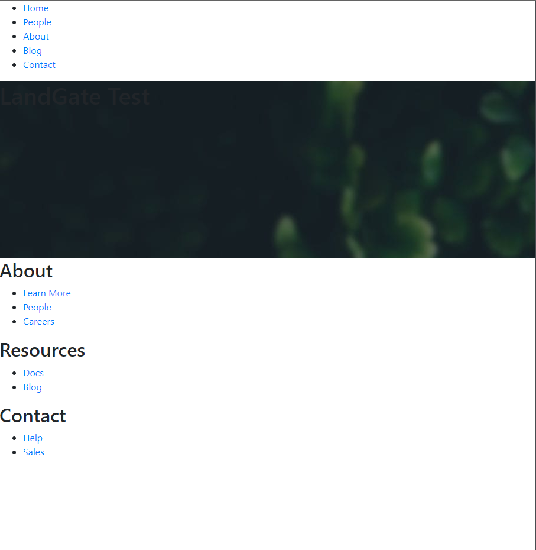
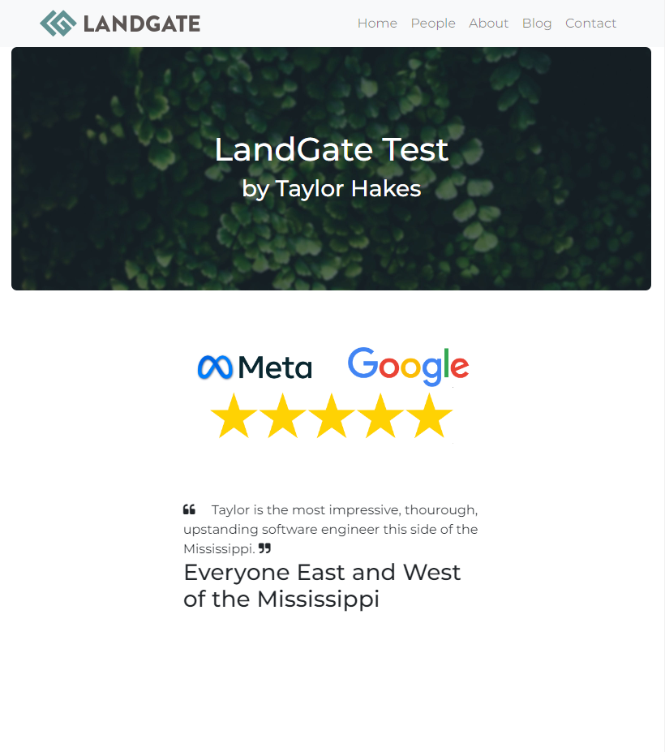
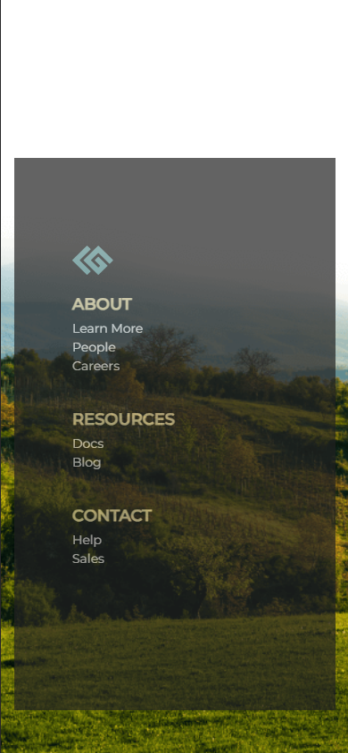
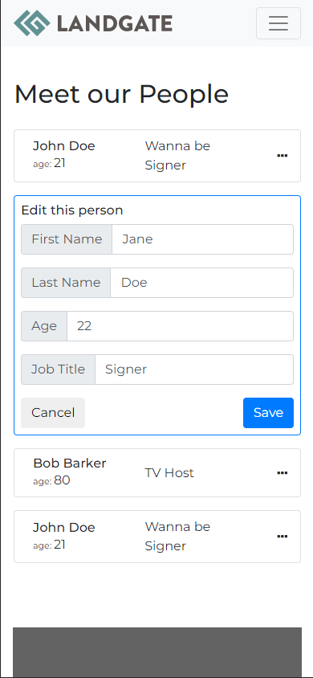

# LandgateUiTest

### Notes 

This test was an excellent experience diving into NGRX to deliver a global store for managing application state. I've often longed for the advantages that NGRX provides while wading through countless Rxjs subjects, overlapping services, and far too many observable streams while working on Eve's enterprise applications. At the time, the cost to overhaul our codebase and implement NGRX couldn't be justified. It was easier for us to rush our products out the door with Rxjs subject state management, but if I could go back and go it again it would be NGRX all the way. Components having acccess to the global store and simply dispatching actions seems to remove so much unecessary movement of large streams of data around the app, as well as simultaneously restricts the amount of business logic these components need to perform. The immutable nature of the store feels so much more confidence inspiring than easily manipulatable observable streams. I once spent 4 hours debugging an observable that was being transformed way down the line after emitting its first value because I thought it was manipulating a deep copy. I also found the NGRX selectors to be a brilliant method of creating slices of data streams that are razor-specific to your component's data dependencies, regardless of having one (potentially massive) data store. Ultimately, the establishment of NGRX seems to require a little bit of extra time and attention, but where such is justified it can provide extremely powerful, consistent, and surprisingly simple state management. The Redux Chrome extension also makes debugging an absolute breeze.

### Source Code UI:

### Finished Test UI and Deployed Link:

[Visit the finished site here](https://sadboitay.github.io/landgate-ui-test/)

### Summary

The major criteria included making a repsonsive nav bar with a mobile/collapsable menu, adjusting the hero section text visbility, making a responsive 3 column footer, and then creating a route to the 'people' page and there displaying a mock array of people that can be edited and saved. For bonus points (and which I really enjoyed implementing) the use of NGRX as the 'people' state management mechanism, an additional creative home page section, and additional footer stylings. In total, I likely spent over 6 hours on the project becuase I was having too much fun to stop. If pressed, I could produce the same results again in 2 hours.

### Approach

Taking a mobile first approach led me to a simple MVP design for the 'people' cards that behaves consistently across all device sizes. Bootstrap was supplied in the source code, and although I have hundreds (thoudands?) of hours working with the PrimeNG component/theme library, I stuck with bootstrap just to keep things fresh and simple, and I had no regrets. For my bonus section and styles, I decided to spare myself the headache of designing while coding and draw inspiration straight from the source: [the LandGate company landing page](https://landgate.com/home) itself. Dissecting their live Angular application provided UI design criteria for myself to adhere to, while supplying the opportunity to include some light hearted humor.

### Further Developement

If I were building this site for an intended production audience (and if I didn't have some small bit of self control) there are many features and updates that I would pursue. ~~Firstly, there seems to be a refresh bug on the github pages hosted site which produces a 404~~ (this was resolved via the Angular docs [here](https://angular.io/guide/deployment#deploy-to-github-pages). I also couldn't quite get the carousel of quotes to display 2 or 3 items simultaneously on larger screens, like LandGate's production site does like breathing. Theirs looks way better. The rest of the updates would fall into the 'people' page. Here, I was tempted to add mock error handling and corresponding UI elements, use Angulars reactive forms to supply much needed validation to the 'person' editing input fields, and some smooth transition animations that would elevate the experience from the jarring expansion/contraction of selected 'people' in their edit vs static card states. To top it off, a success message after performing an edit and a confirmation mechanism for ensuring the user wants to cancel their edit would really bring the UX together well.

## Test Criteria Provided by LandGate:

This project was generated with [Angular CLI](https://github.com/angular/angular-cli) version 8.3.22.  Please follow the Angular Cli link on how to setup and install the required dependencies.  

This test project is designed to help us understand your level of web development skills with Angular, NGRX, HTML, CSS, TypeScript, and Javascript. This project is not meant for you to take many hours to complete.  You are however free to spend as much time as you would like completing it. The suggested time to spend is between two and three hours.

### General Instructions

It is advised that you read through all the various parts to understand the overall scope and expectations of this project. The instructions are separated into two parts. You will find the generalized expectations in this ReadMe below. 
You will also find throughout the HTML and Angular code suggested implementation points (these will be noted by a // TODO: with instructions).      

### Part 1 - HTML and CSS
We have created a basic home page layout with a header, footer, and content section. Use whatever techniques and libraries you are familiar with to style the home page. Think mobile first when applying your styles. Included in the project configuration is Bootstrap however feel free to use the styling approach of your choice.  

#### Steps to complete:
- Make the header component a navigation bar with links that shrinks to a menu button in mobile view.

- Make the content section text horizontally and vertically aligned as well as styled white in color.

- Make the footer component a responsive 3 column layout.

### Part 2 - Angular / TypeScript / NGRX
Within the Header component there is a placeholder for a link to a People Component.  There is a skeleton of that component included in the repository.  

#### Steps to complete:
- Create a new route in app-routing.module.ts to the people component **or** use people-ngrx (see below for bonus details on using people-ngrx)
- Look inside the people(-ngrx) html and people(-ngrx) component.ts for instructions on what to implement.
- PersonModel needs completion
- people.service.ts needs completion
- If you choose to implement using people-ngrx the actions / effects / reducer / selectors need completion.

### Part 3 Bonus:
This is the bonus section for individuals who want the make the best impression.  The below is purposely vague to give you a chance to shine and standout among the crowd.
 
  HTML and CSS
  
  - Apply a good web font
  - Colorize footer
  - Add custom section to home page (use your imagination)
  
  Angular / TypeScript / NGRX
  
  - People / People-Ngrx have the same implementation requirements except People-Nrgx uses the Ngrx Store as a data mechanism.
    There is inside of the people-ngrx folder a skeleton of a people feature with actions / selectors / effects and reducer.  
    LandGate uses NGRX for state management.  Being able to complete the People-Ngrx will be looked on quite favorably.

## Simple Setup

Run `npm install`
      
## Development server

Run `ng serve` for a dev server. Navigate to `http://localhost:4200/`. The app will automatically reload if you change any of the source files.

## Code scaffolding

Run `ng generate component component-name` to generate a new component. You can also use `ng generate directive|pipe|service|class|guard|interface|enum|module`.

## Build

Run `ng build` to build the project. The build artifacts will be stored in the `dist/` directory. Use the `--prod` flag for a production build.

## Running unit tests

Run `ng test` to execute the unit tests via [Karma](https://karma-runner.github.io).

## Running end-to-end tests

Run `ng e2e` to execute the end-to-end tests via [Protractor](http://www.protractortest.org/).

## Further help

To get more help on the Angular CLI use `ng help` or go check out the [Angular CLI README](https://github.com/angular/angular-cli/blob/master/README.md).
